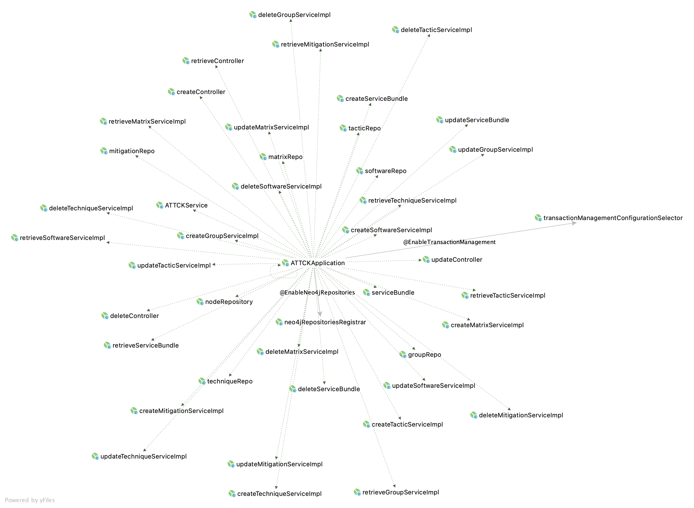
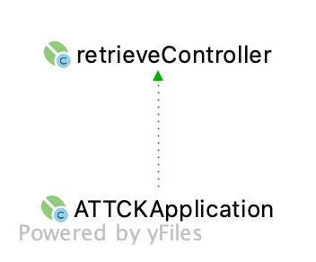
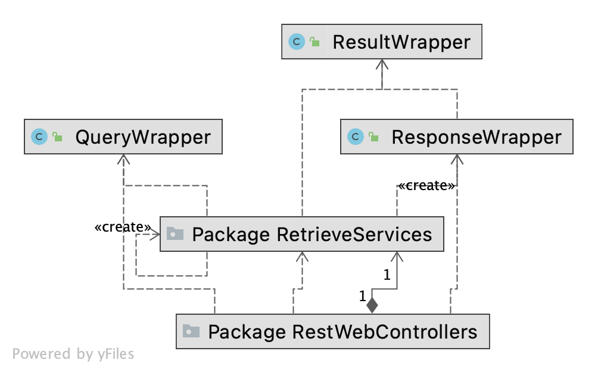
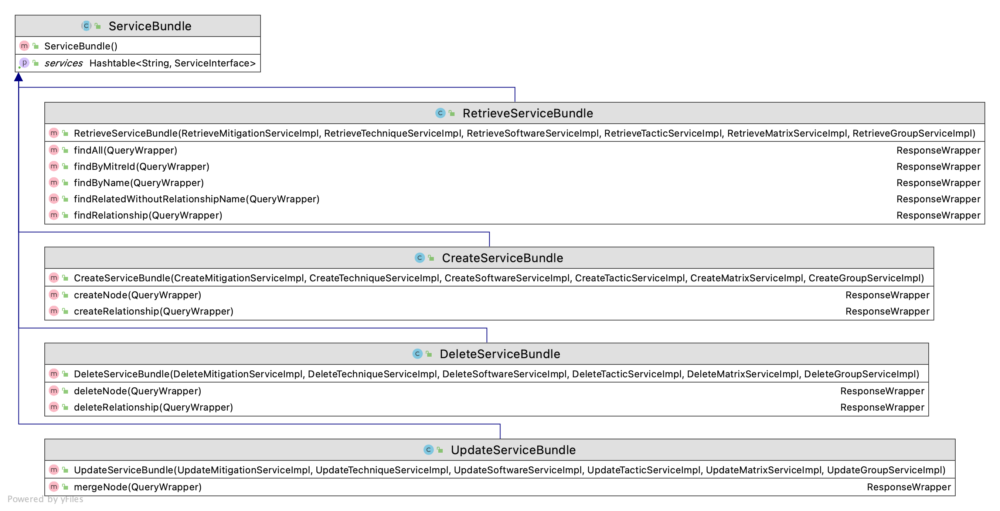
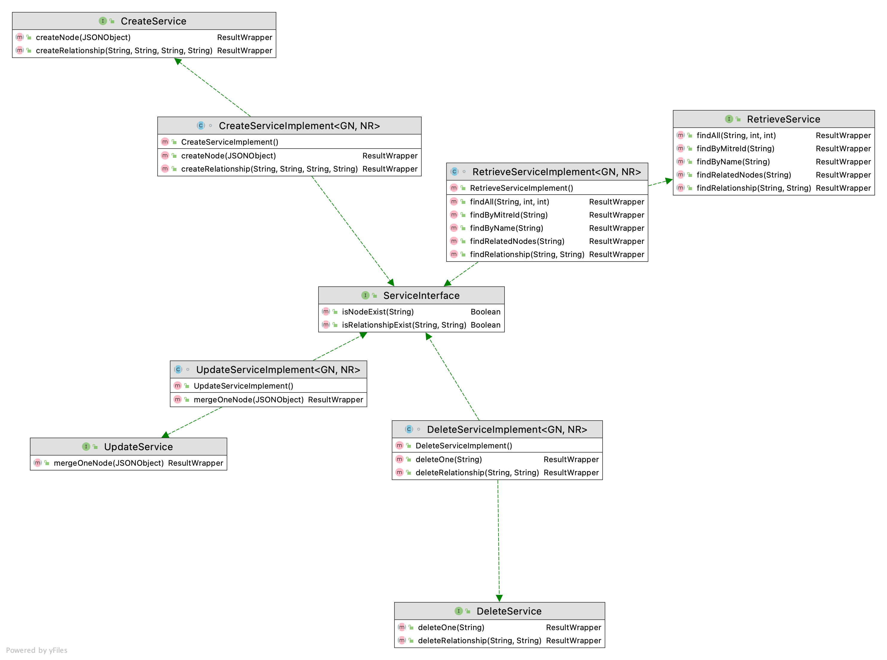
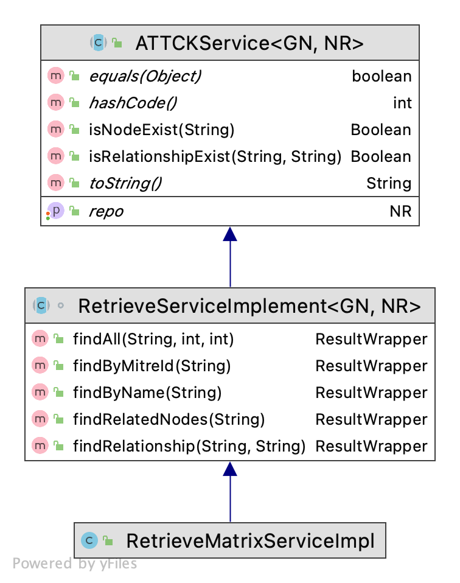
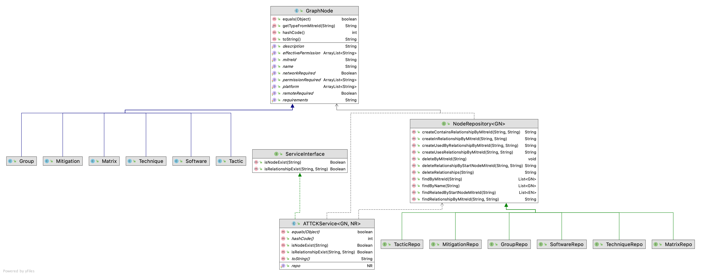

#ATT&CK知识图谱增删改查后端开发文档

### 本项目是ATT&CK攻防知识图谱数据库的增删改查后端接口，知识图谱存储于neo4j数据库中。

##1. 开发基本信息
本项目采用`Java 11`作为开发语言，使用`SpringBoot`作为后端基本框架，使用`Spring Data neo4j`作为数据库层。
此框架具有轻量、开发便捷、耦合度低等特点。

* JDK版本：`OpenJDK 11.0.10`
* 项目构建：`Apache Maven 3.8.1`
* 版本控制：`git 2.31.1`
* 开发环境：`macOS 11.2.3`
* 测试环境：`Ubuntu Linux 20.04 LTS`
* 使用IDE：`JetBrains Intellij IDEA Ultimate 2021.1`

## 2. 项目概况

### i. 关于项目整体情况，详见 [JavaDoc](JavaDoc/index.html)

### ii. 测试样例

取自 test/java/uestc/zhanghanwen/ATTCK/RestWebControllers 中的JUnit测试类

### iii. 接口详见 [USAGE.md](USAGE.md)

## 3. 项目UML结构

### Spring Service 总体情况，`main`方法位于`ATTCKApplication`中，所有`service`通过`@Service`注解自动注册，并通过`@Autowired`注解绑定。

 
 
 

### 如图所示，是`RetrieveController`与`ATTCKApplication`的自动绑定

 
 
 

### `RetrieveController`通过调用`Wrappers`包中的`QueryWrapper`, `ResponseWrapper`, `ResultWrapper`类与`RetrieveServices`包交换

 
 
 

### 具体而言，`ServiceBundle`为`RestWebControllers`所调用，为某一类Service的集合

 
 
 

### 为了让不同的`Service`实现不同的方法，都继承自`ServiceInterface`

 
 
 

### 而具体的`***ServiceImpl`继承自`ATTCKService`

 
 
 

### 数据绑定层与POJO(Plain Old Java Object)

 
 
 

## 4. Official documentations of Spring data Neo4j

### Getting Started

#### Reference Documentation

For further reference, please consider the following sections:

* [Official Apache Maven documentation](https://maven.apache.org/guides/index.html)
* [Spring Boot Maven Plugin Reference Guide](https://docs.spring.io/spring-boot/docs/2.3.2.RELEASE/maven-plugin/reference/html/)
* [Create an OCI image](https://docs.spring.io/spring-boot/docs/2.3.2.RELEASE/maven-plugin/reference/html/#build-image)
* [Spring Web](https://docs.spring.io/spring-boot/docs/2.3.2.RELEASE/reference/htmlsingle/#boot-features-developing-web-applications)
* [Spring Data Neo4j](https://docs.spring.io/spring-boot/docs/2.3.2.RELEASE/reference/htmlsingle/#boot-features-neo4j)

#### Guides

The following guides illustrate how to use some features concretely:

* [Building a RESTful Web Service](https://spring.io/guides/gs/rest-service/)
* [Serving Web Content with Spring MVC](https://spring.io/guides/gs/serving-web-content/)
* [Building REST services with Spring](https://spring.io/guides/tutorials/bookmarks/)
* [Accessing Data with Neo4j](https://spring.io/guides/gs/accessing-data-neo4j/)

## 5. Official documents of ATT&CK

### cti

The Cyber Threat Intelligence Repository of ATT&amp;CK and CAPEC catalogs expressed in STIX 2.0 JSON.

### ATT&CK

ATT&CK is a catalog of techniques and tactics that describe post-compromise adversary behavior on typical enterprise IT environments. The core use cases involve using the catalog to analyze, triage, compare, describe, relate, and share post-compromise adversary behavior.

https://attack.mitre.org

### STIX

Structured Threat Information Expression (STIX™) is a language and serialization format used to exchange cyber threat intelligence (CTI).

STIX enables organizations to share CTI with one another in a consistent and machine-readable manner, allowing security communities to better understand what computer-based attacks they are most likely to see and to anticipate and/or respond to those attacks faster and more effectively.

STIX is designed to improve many capabilities, such as collaborative threat analysis, automated threat exchange, automated detection and response, and more.

https://oasis-open.github.io/cti-documentation/

### CAPEC

Understanding how the adversary operates is essential to effective cyber-security. CAPEC™ helps by providing a comprehensive dictionary of known patterns of attacks employed by adversaries to exploit known weaknesses in cyber-enabled capabilities. It can be used by analysts, developers, testers, and educators to advance community understanding and enhance defenses.

- Focuses on application security
- Enumerates exploits against vulnerable systems
- Includes social engineering / supply chain
- Associated with Common Weakness Enumeration (CWE)

https://capec.mitre.org/

### Mapping Concepts

First, we must describe how ATT&CK objects and properties map to STIX 2.0 objects and properties.

#### Objects

In ATT&CK, there are three main concepts (excluding Tactics for now): Techniques, Groups, and Software. Most techniques also have Mitigations. STIX 2.0 describes these as objects and uses different terminology to describe them. The following table is a mapping of ATT&CK concepts to STIX 2.0 objects:

| ATT&CK concept | STIX Object type    |
|----------------|---------------------|
| Technique      | `attack-pattern`    |
| Group          | `intrusion-set`     |
| Software       | `malware` or `tool` |
| Mitigation     | `course-of-action`  |
| Tactic         | `x-mitre-tactic`    |
| Matrix         | `x-mitre-matrix`    |

The above STIX types are found as literal strings assigned to the `type` property of the STIX JSON object. As shown in the table, in STIX 2.0, there are objects called "Course(s) of Action" used to describe mitigations to ATT&CK techniques. Similarly, the STIX 2.0 object called "Attack Pattern" describes techniques, etc. It should also be noted that Tactics are not an explicit object type in STIX 2.0, and they are referenced implicitly as kill chain phases within the other object types, as described in the tables below.

#### Properties

The following is a table mapping of ATT&CK properties, the old ATT&CK MediaWiki names, and the new STIX properties. Some of these properties are standard STIX properties, while others were custom-created for compatibility with ATT&CK. These properties are accessed from STIX objects as JSON properties.

##### Migrating from MediaWiki

##### Common properties (on all objects)

| ATT&CK Property   | ATT&CK MediaWiki                  | STIX Properties                                                                                   |
|-------------------|-----------------------------------|---------------------------------------------------------------------------------------------------|
| **Entry ID**      | `Has ID`                          | `external_references[i].external_id` where `external_references[i].source_name == "mitre-attack"` |
| **Entry URL**     | `URL`                             | `external_references[i].url` where `external_references[i].source_name == "mitre-attack"`         |
| **Entry Title**   | `Has display name`                | `name`                                                                                            |
| **Entry Text**    | `Has description`                 | `description`                                                                                     |
| **Citation**      | `Citation reference`              | `external_references`                                                                             |
| **Deprecated**    | `Deprecated`                      | `x_mitre_deprecated`                                                                              |
| **Revoked**       | `Not available via MediaWiki API` | `revoked`                                                                                         |
| **Old ATT&CK ID** | `Not available via MediaWiki API` | `x_mitre_old_attack_id`                                                                           |

##### Techniques

| ATT&CK Property           | ATT&CK MediaWiki                       | STIX Properties                                                                                                                                      |
|---------------------------|----------------------------------------|------------------------------------------------------------------------------------------------------------------------------------------------------|
| **Entry Title**           | `Has technique name`                   | `name`                                                                                                                                               |
| **Tactic**                | `Has tactic`                           | `kill_chain_phases[i].phase_name` where `kill_chain_phases[i].kill_chain_name == "mitre-attack"`                                                     |
| **Description**           | `Has technical description`            | `description`                                                                                                                                        |
| **Mitigation**            | `Has mitigation`                       | `relationship` where `relationship_type == "mitigates"`, points from a source object with `type=="course-of-action"`, which contains a `description` |
| **Detection**             | `Has detection`                        | `description` (inline heading of Detection)                                                                                                          |
| **Examples**              | in software, groups as `Has technique` | `relationship`, points from the `attack-pattern` to and from `malware`, `tool`, and `intrusion-set`                                                  |
| **Platform**              | `Has platform`                         | `x_mitre_platforms`                                                                                                                                  |
| **Data Sources**          | `Has data source`                      | `x_mitre_data_sources`                                                                                                                               |
| **Permissions Required**  | `Requires permissions`                 | `x_mitre_permissions_required`                                                                                                                       |
| **Effective Permissions** | `Has effective permissions`            | `x_mitre_effective_permissions`                                                                                                                      |
| **Defense Bypassed**      | `Bypasses defense`                     | `x_mitre_defense_bypassed`                                                                                                                           |
| **System Requirements**   | `Has system requirements`              | `x_mitre_system_requirements`                                                                                                                        |
| **Network Requirements**  | `Has network requirements`             | `x_mitre_network_requirements`                                                                                                                       |
| **Remote Support**        | `Has remote support`                   | `x_mitre_remote_support`                                                                                                                             |
| **Contributors**          | `Has contributor`                      | `x_mitre_contributors`                                                                                                                               |
| **Impact Type**           | `Not available via MediaWiki API`      | `x_mitre_impact_type`                                                                                                                                |

##### Software

| ATT&CK Property     | ATT&CK MediaWiki  | STIX Properties                                                                                                 |
|---------------------|-------------------|-----------------------------------------------------------------------------------------------------------------|
| **Techniques Used** | `Has technique`   | `relationship` where `relationship_type == "uses"`, points to a `target` object with `type== "attack-pattern"`  |
| **Aliases**         | `Has alias`       | `x_mitre_aliases`                                                                                               |
| **Groups**          | `Has groups`      | `relationship` where `relationship_type == "uses"`, points from a `source` object with `type== "intrusion-set"` |
| **Contributors**    | `Has contributor` | `x_mitre_contributors`                                                                                          |

##### Groups

| ATT&CK Property        | ATT&CK MediaWiki  | STIX Properties                                                                                                   |
|------------------------|-------------------|-------------------------------------------------------------------------------------------------------------------|
| **Techniques Used**    | `Has technique`   | relationship where `relationship_type == "uses"`, points to a `target` object with `type == "attack-pattern"`     |
| **Alias Descriptions** | `Has alias`       | `aliases`                                                                                                         |
| **Software**           | `Has groups`      | `relationship` where `relationship_type == "uses"`, points to a `target` object with `type== "malware" or "tool"` |
| **Contributors**       | `Has contributor` | `x_mitre_contributors`                                                                                            |